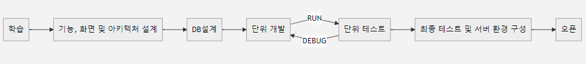

#   Umamusi Project
> USW Computer Science : [**HumanHyeon**](https://github.com/HumanHyeon),  [**y00913**](https://github.com/y00913),  [**7IEH**](https://github.com/7IEH)

**umamusi** 프로젝트는 **JavaScript**를 이용하여 Web에서 **Pentago** 게임을 만드는 것을 목표로 하고 있습니다.    
회원가입 기능을 통해 유저를 생성하고 원하는 상대와 게임을 하기 위해 대기방을 만들 것입니다.   
대기방에는 **게임 목록**, **채팅**, **전적 보기**, **대기자 목록** 등을 보여줄 것입니다.    
TCP 통신을 이용하여 2명의 유저가 실시간으로 게임을 진행합니다.   
게임화면에서는 **실시간 게임판**, **채팅** 등이 있습니다.

    

## Tech Stack

 |Kinds          |Using           |
|----------------|----------------|
|**`Langugage`**     |JavaScript      |
|**`Framework`**     |Node.Js         |
|**`Used Library`**  | ...            |
|**`추가할 예정`**   | ...            |

  
 
## Requirements Specification

### [ Index Page ]
 *  로그인
 *  회원가입
 
 ### [ Waiting Room ]
* 게임방
* 대기자 목록
* 실시간 채팅
* 전적 보기
* 로그아웃

### [ Game ]
* 게임판
* 실시간 채팅
* 게임 기능 버틍(시작, 기권, 무르기 등)
* 나가기(대기방 이동)

  

## Milestone

#### 4 month project (19 weeks)
### 4 month project (19 weeks)
